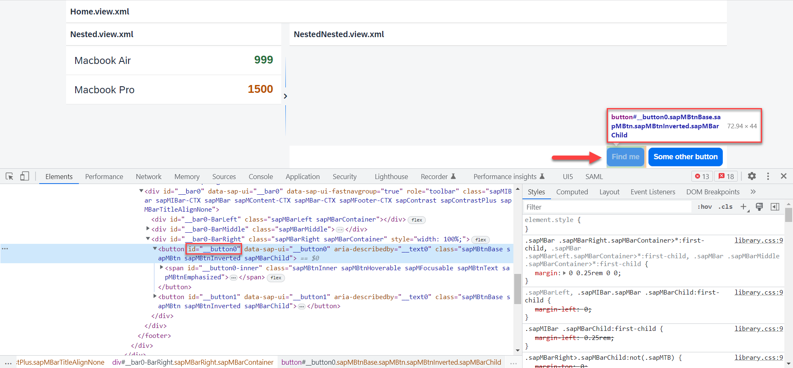
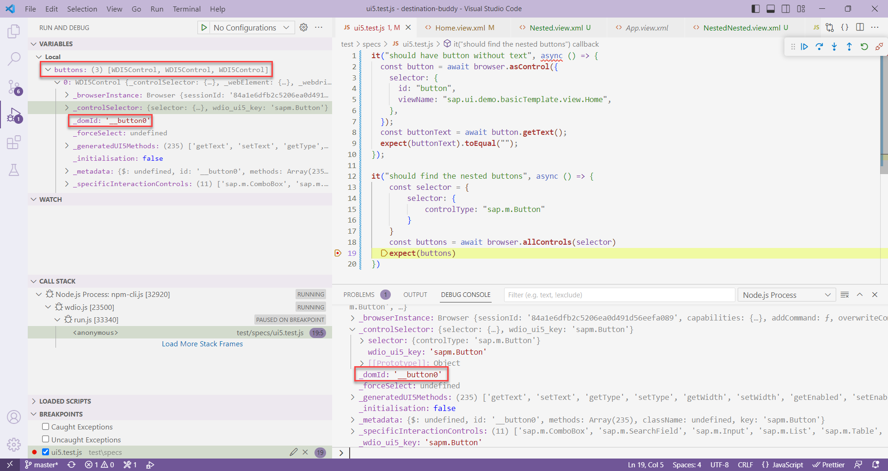
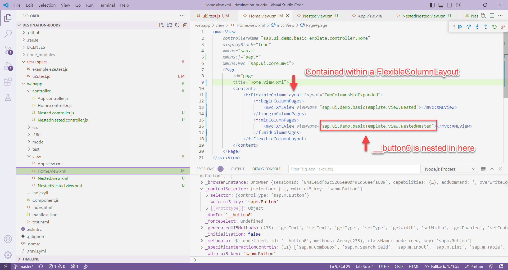

# wdi5-flexiblecolumnlayout
Sample application to showing it is possible to target controls in nested views.

## Setup
1. Clone the repository and navigate into it
    ```sh
    git clone git@github.com:robbyjm/wdi5-flexiblecolumnlayout.git
    cd wdi5-flexiblecolumnlayout
    ```
1. Install all dependencies
    ```sh
    npm install
    ```

1. Start a local server and run the application (http://localhost:8080/index.html)
    ```sh
    ui5 serve -o /index.html
    ```

## WDI5 Tests
* Run WDI5 test
    ```sh
    npm run wdi5
    ```